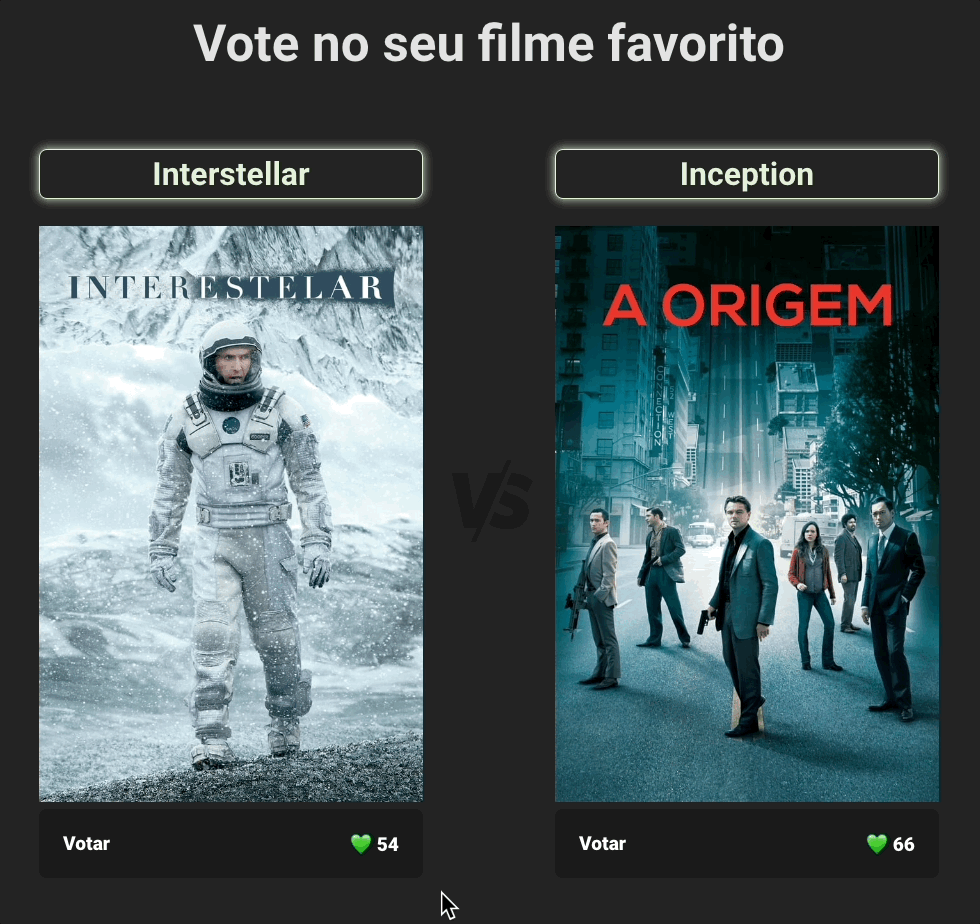

# Movie Voting App

Este é um aplicativo simples de votação de filmes construído com React. Ele usa JSON Server como uma API de back-end para persistir os dados de votação.

## Como executar o aplicativo

1. Clone este repositório para sua máquina local.
2. Navegue até o diretório do projeto em um terminal.
3. Execute `npm install` para instalar todas as dependências do projeto.
4. Execute `npm run server` para iniciar o JSON Server.
5. Em um novo terminal, navegue até o diretório do projeto e execute `npm start` para iniciar o aplicativo React.

Agora você deve ser capaz de acessar os endpoints em `http://localhost:3000`.

## Como usar o aplicativo

Cada filme listado no aplicativo tem um botão "Votar". Clique neste botão para votar no filme. O número de votos para cada filme é exibido abaixo do botão.

## Contribuindo

Contribuições são bem-vindas! Por favor, abra um issue ou pull request se você gostaria de contribuir com o projeto.

